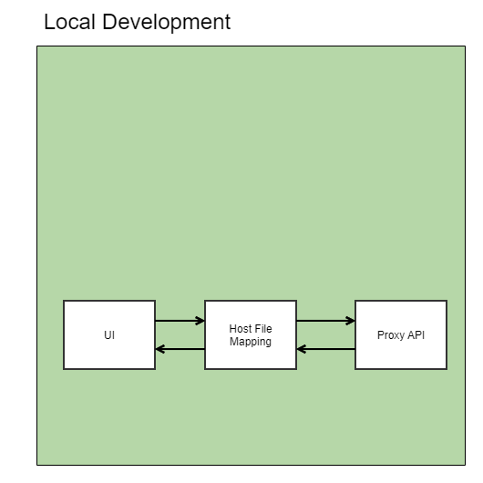
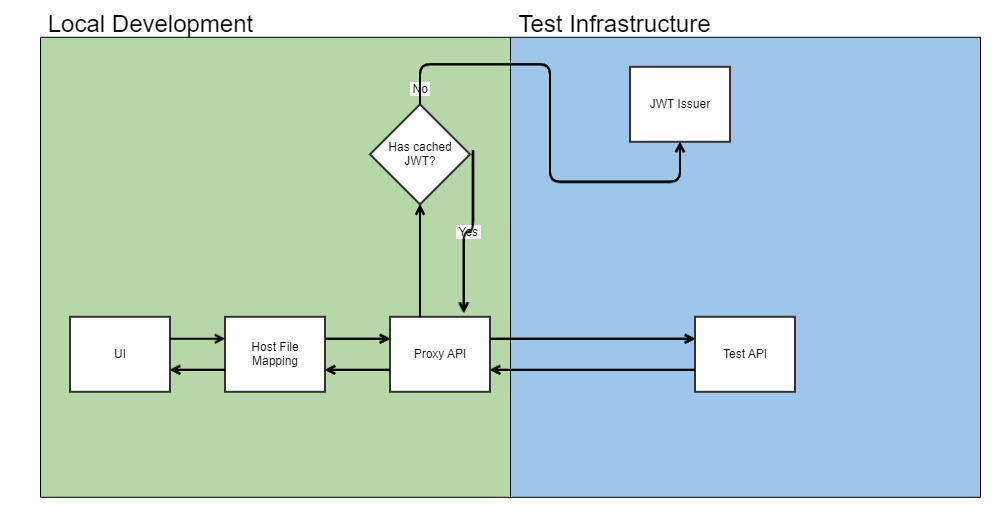

# Introduction

This is an example project for a mock API. The API has two modes of operating:

1. As an API Gateway to proxy API calls to Test
2. As a mock API to return mock API responses

# Getting Started

To get started with this api, simply type in the following commands to start the API.

## Mock API:

Run the following commands:

```bash
npm install
npm run mock
```

## Proxy API:

Edit the file src/proxy-configs.js with your app url and issuer. Then run the following commands:

```bash
npm install
npm run proxy
```

# FAQ

## Why are there no tests?

This is a mock API and tends to change quite a bit. Writing tests for this doesn't really make sense and if you really wanted to have tests, you could just use the integration tests from the actual API.

## Don't you need to refresh the JWT Token?

For our dev issuers, the token lasts for 6 hours so it's not really necessary and adds complexity.

## Why don't you use a map in the mock api?

Since the data is stored in an array, we just chose to parse through it instead of converting it into a map of id's to objects.

# Architectural Diagrams

## Mock API Digram



## Proxy API Digram


